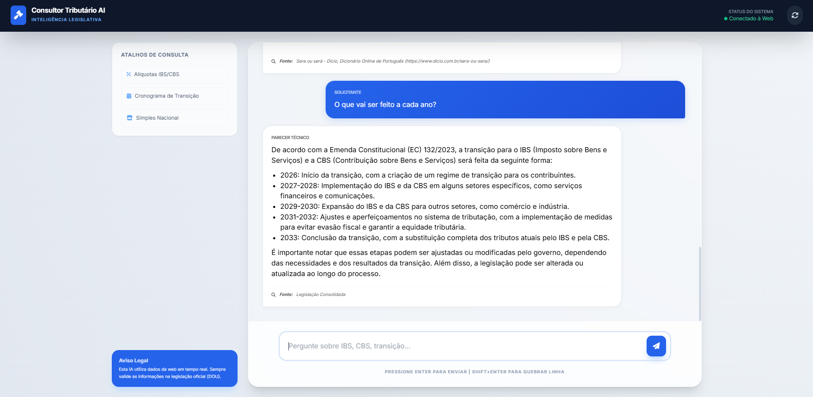

# 🧾 Consultor Tributário AI



**Agente inteligente para análise da Reforma Tributária (EC 132/2023) com dados atualizados da web**

---

## 📌 Visão Geral

Este projeto é um **agente de IA fullstack** composto por:

* **Frontend (HTML + Tailwind + JS)** → Interface estilo chat (semelhante ao ChatGPT)
* **Backend (FastAPI + Python)** → Orquestra IA + busca web
* **LLM via Groq API** → Respostas rápidas com modelo `llama-3.3-70b-versatile`
* **Busca em tempo real (DuckDuckGo)** → Atualização com dados recentes

O sistema é projetado para responder perguntas sobre a **Reforma Tributária Brasileira**, com foco em:

* IBS / CBS
* Transição (2026–2033)
* Impactos fiscais
* Simples Nacional

---

## ⚠️ IMPORTANTE — Uso da API

O código atualmente contém uma **chave de API pública/limitada**:

```python
GROQ_API_KEY = "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"
```

### 🚨 Limitações

* Essa chave é **gratuita e limitada (~1000 requisições)**
* Pode parar de funcionar a qualquer momento
* Não deve ser usada em produção

---

## ✅ Recomendação

**Você DEVE usar sua própria API Key da Groq:**

1. Acesse: [https://console.groq.com/](https://console.groq.com/)
2. Gere sua chave
3. Substitua no código:

```python
GROQ_API_KEY = "sua_chave_aqui"
```

---

## 🧠 Arquitetura

```
Frontend (index.html)
        ↓
Fetch API (HTTP)
        ↓
FastAPI (main.py)
        ↓
├── Busca Web (DuckDuckGo)
└── LLM (Groq API)
        ↓
Resposta estruturada
```

---

## 🚀 Como Rodar Localmente

### 1. Clone o projeto

```bash
git clone https://github.com/seu-usuario/consultor-tributario-ai.git
cd consultor-tributario-ai
```

---

### 2. Crie ambiente virtual

```bash
python -m venv venv
```

Ativar:

**Windows**

```bash
venv\Scripts\activate
```

**Linux/Mac**

```bash
source venv/bin/activate
```

---

### 3. Instale dependências

```bash
pip install fastapi uvicorn httpx groq duckduckgo_search
```

---

### 4. Execute o backend

```bash
python main.py
```

Servidor rodando em:

```
http://127.0.0.1:8000
```

---

### 5. Execute o frontend

Abra o arquivo:

```
index.html
```

ou use um servidor local:

```bash
python -m http.server 5500
```

---

## 🔐 Segurança (CRÍTICO)

O código foi propositalmente escrito de forma **não ideal para produção**, pois foi utilizado em:

> ambiente corporativo restrito, com proxy interno, inspeção SSL e validação desabilitada

### ⚠️ Problemas atuais

#### 1. SSL desabilitado

```python
httpx.Client(verify=False)
```

#### 2. Avisos ignorados

```python
urllib3.disable_warnings()
```

#### 3. CORS aberto

```python
allow_origins=["*"]
```

---

## ✅ Como corrigir para produção

### ✔️ 1. Ativar verificação SSL

```python
httpx.Client(timeout=45.0)
```

---

### ✔️ 2. Remover:

```python
urllib3.disable_warnings()
```

---

### ✔️ 3. Restringir CORS

```python
allow_origins=["http://localhost:5500"]
```

ou domínio real:

```python
allow_origins=["https://seusite.com"]
```

---

### ✔️ 4. Usar variável de ambiente (OBRIGATÓRIO)

```python
import os

GROQ_API_KEY = os.getenv("GROQ_API_KEY")
```

Criar `.env`:

```
GROQ_API_KEY=sua_chave_aqui
```

---

### ✔️ 5. Nunca commitar chave no Git

Adicione ao `.gitignore`:

```
.env
```

---

## 🧩 Funcionalidades

* ✅ Interface estilo ChatGPT
* ✅ Renderização Markdown
* ✅ Histórico de conversa (limitado)
* ✅ Busca web em tempo real
* ✅ Respostas jurídicas contextualizadas
* ✅ Baixa temperatura (evita alucinação)

---

## 📉 Limitações Técnicas

* Sem cache → custo maior de API
* Sem autenticação
* Sem rate limit
* Sem persistência de dados
* Contexto limitado (últimas 4 mensagens)

---

## 🔧 Melhorias Recomendadas

Se quiser evoluir isso aqui, vá nessa linha:

### Backend

* Redis (cache de respostas)
* Rate limiting (slowapi)
* Logging estruturado
* RAG com PDFs jurídicos

### Frontend

* Streaming de resposta (SSE/WebSocket)
* Upload de documentos
* Persistência local (IndexedDB)

### Infra

* Docker
* Deploy (Railway / Fly.io / AWS)
* HTTPS com proxy reverso (NGINX)

---

## ⚖️ Aviso Legal

Este sistema:

* Não substitui advogado ou contador
* Pode conter interpretações incorretas
* Deve ser validado com legislação oficial (DOU, Receita Federal, etc.)

---

## 📄 Licença

MIT License

---

## 👨‍💻 Autor

Projeto desenvolvido para fins educacionais e experimentação com IA aplicada ao Direito Tributário.


Só dizer.
