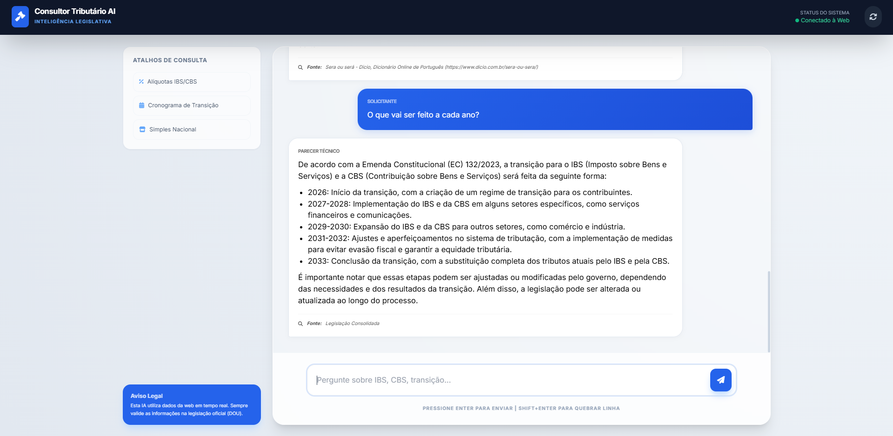

# 🧾 Consultor Tributário AI




**Agente inteligente para análise da Reforma Tributária (EC 132/2023) com dados atualizados da web**

---

## 📌 Visão Geral

Este projeto é um **agente de IA fullstack** composto por:

- **Frontend (HTML + Tailwind + JS)** → Interface estilo chat (semelhante ao ChatGPT)
- **Backend (FastAPI + Python)** → Orquestra IA + busca web
- **LLM via Groq API** → Respostas rápidas com modelo `llama-3.3-70b-versatile`
- **Busca em tempo real (DuckDuckGo)** → Atualização com dados recentes

O sistema é projetado para responder perguntas sobre a **Reforma Tributária Brasileira**, com foco em:

- IBS / CBS
- Transição (2026–2033)
- Impactos fiscais
- Simples Nacional

---

## 🔑 Configuração da API (Groq)

Este projeto usa a API da Groq para o LLM. A chave de API **nunca** deve ficar exposta no código ou no README — configure-a sempre como variável de ambiente:

```python
import os
GROQ_API_KEY = os.getenv("GROQ_API_KEY")
```

Crie um arquivo `.env` na raiz do projeto (e garanta que ele está no `.gitignore`):

```
GROQ_API_KEY=sua_chave_aqui
```

Gere sua chave gratuita em [console.groq.com](https://console.groq.com/).

### 🚨 Limitações da camada gratuita

- Cota de requisições limitada
- Pode variar conforme a política da Groq
- Não recomendada para uso em produção sem monitoramento de uso

---

## 🧠 Arquitetura

```
Frontend (index.html)
        ↓
  Fetch API (HTTP)
        ↓
  FastAPI (main.py)
        ↓
  ├── Busca Web (DuckDuckGo)
  └── LLM (Groq API)
        ↓
  Resposta estruturada
```

---

## 🚀 Como Rodar Localmente

### 1. Clone o projeto
```
git clone https://github.com/seu-usuario/consultor-tributario-ai.git
cd consultor-tributario-ai
```

### 2. Crie ambiente virtual
```
python -m venv venv
```

Ativar:

**Windows**
```
venv\Scripts\activate
```

**Linux/Mac**
```
source venv/bin/activate
```

### 3. Instale dependências
```
pip install fastapi uvicorn httpx groq duckduckgo_search
```

### 4. Execute o backend
```
python main.py
```

Servidor rodando em: `http://127.0.0.1:8000`

### 5. Execute o frontend

Abra o arquivo `index.html` ou use um servidor local:
```
python -m http.server 5500
```

---

## 🔐 Segurança (CRÍTICO)

O código foi propositalmente escrito de forma não ideal para produção, pois foi utilizado em ambiente corporativo restrito, com proxy interno, inspeção SSL e validação desabilitada.

### ⚠️ Problemas atuais

1. **SSL desabilitado**
```python
httpx.Client(verify=False)
```
2. **Avisos ignorados**
```python
urllib3.disable_warnings()
```
3. **CORS aberto**
```python
allow_origins=["*"]
```

### ✅ Como corrigir para produção

✔️ 1. Ativar verificação SSL
```python
httpx.Client(timeout=45.0)
```
✔️ 2. Remover:
```python
urllib3.disable_warnings()
```
✔️ 3. Restringir CORS
```python
allow_origins=["http://localhost:5500"]
```
ou domínio real:
```python
allow_origins=["https://seusite.com"]
```
✔️ 4. Usar variável de ambiente (OBRIGATÓRIO) — já aplicado na seção de configuração acima.

✔️ 5. Nunca commitar a chave no Git — adicione ao `.gitignore`:
```
.env
```

---

## 🧩 Funcionalidades

✅ Interface estilo ChatGPT
✅ Renderização Markdown
✅ Histórico de conversa (limitado)
✅ Busca web em tempo real
✅ Respostas jurídicas contextualizadas
✅ Baixa temperatura (evita alucinação)

---

## 📉 Limitações Técnicas

- Sem cache → custo maior de API
- Sem autenticação
- Sem rate limit
- Sem persistência de dados
- Contexto limitado (últimas 4 mensagens)

---

## 🔧 Melhorias Recomendadas

**Backend**
- Redis (cache de respostas)
- Rate limiting (slowapi)
- Logging estruturado
- RAG com PDFs jurídicos

**Frontend**
- Streaming de resposta (SSE/WebSocket)
- Upload de documentos
- Persistência local (IndexedDB)

**Infra**
- Docker
- Deploy (Railway / Fly.io / AWS)
- HTTPS com proxy reverso (NGINX)

---

## ⚖️ Aviso Legal

Este sistema:

- Não substitui advogado ou contador
- Pode conter interpretações incorretas
- Deve ser validado com legislação oficial (DOU, Receita Federal, etc.)

---

## 📄 Licença

MIT License

## 👨‍💻 Autor

Projeto desenvolvido por Anderson Moegel para fins educacionais e experimentação com IA aplicada ao Direito Tributário.
